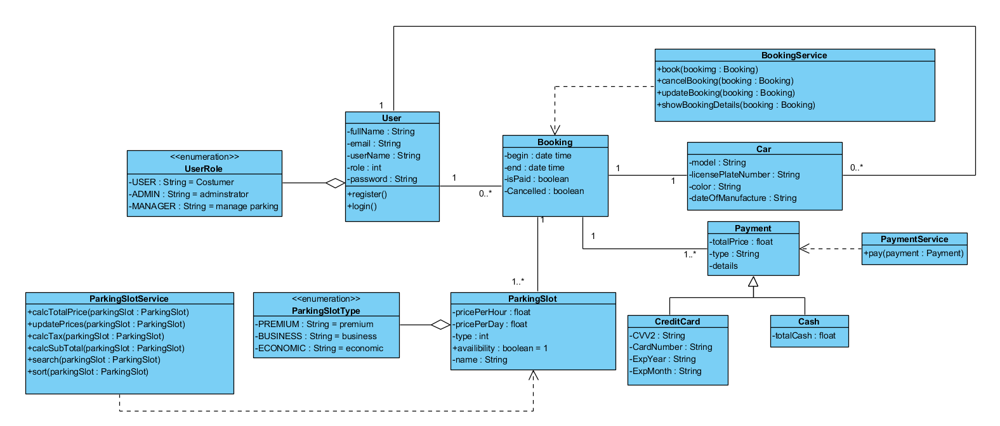
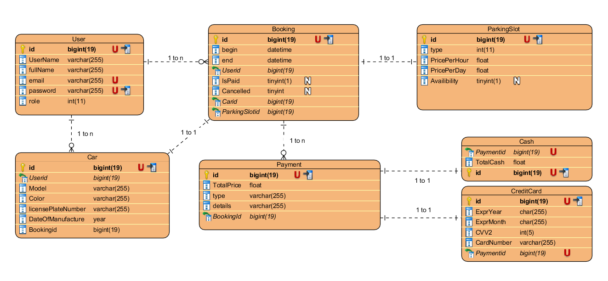

<div dir="rtl">

##  سیستم رزور جای پارک آنلاین - ParkingSystem 
| نقش (Role) | دسترسی‌ها (Permissions)                                                                     |
| ---------- | ----------------------------------------------------------------------------------------- |
|  Admin   | مدیریت کاربران، ویرایش و مشاهده پرداخت ها، ویرایش و حذف جای پارک ها، مشاهده و حذف ماشین ها و کاربران             |
|  Manager | ویرایش و ایجاد جای پارک ها، ویرایش و مشاهده رزور ها                                                    |
|  User    | پرداخت و مشاهده پرداخت های خود، ایجاد و ویرایش و حذف ماشینهای خود، رزور و مشاهده و کنسل کردن رزور های خود       |
---
### نمودار کلاس ها


### نمودار erd


---
### درباره پروژه

این پروژه یک سامانه رزرو جای پارک است که شامل سه نوع نقش کاربری می‌باشد: ادمین، منیجر و کاربر عادی.

- **منیجر** ابتدا باید وارد سیستم شود و جای پارک‌های قابل رزرو را اضافه کند.
- پس از آن، **کاربران** می‌توانند در سامانه ثبت‌نام کرده و وارد حساب کاربری خود شوند.
- کاربران می‌توانند اطلاعات خودروی خود را ثبت کرده و از بین جای پارک‌های موجود، یک جای مناسب را برای بازه زمانی مورد نظر خود رزرو کنند.
- پس از انتخاب جای پارک، کاربر می‌تواند هزینه رزرو را به دو روش پرداخت کند:
    - پرداخت با **کارت اعتباری**
    - پرداخت **نقدی** در محل
- مدیر هم می تواند پرداخت ها ویرایش و کاربران و ماشین ها را حذف کند
---
###  ویژگی‌ها

-  عملیات CRUD با RESTFUL API
-  رابط کاربری Blade برای پنل مدیریت , front سیستم
-  پیاده‌سازی **Policy-based Authorization**
-  ساختار **Service Layer** با تزریق وابستگی (Dependency Injection)
-  سیستم **Role-Based Access Control (RBAC)** برای مدیریت سطوح دسترسی کاربران
-  مدیریت کاربران، جایگاه‌ها و خودروها و رزورها
- ساختار تمیز و قابل گسترش برای پروژه‌های واقعی
---
###  نصب و راه‌اندازی

#### 1. پروژه را clone کنید
```bash
git clone https://github.com/yusofsf/ParkingSystem.git
cd ParkingSystem 
```

#### 2.نصب با command
```bash
php artisan install:ParkingSystem
php artisan serve
```
### یا 

#### 1.3 نصب وابستگی ها
```bash
composer install
npm install
```

#### 2.3 تولید key و فایل env.
```bash
cp .env.example .env 
php artisan key:generate
```
#### 3.3 تنظیم اطلاعات DB در فایل env.
```bash
DB_DATABASE=your-db-name
DB_USERNAME=your-username
DB_PASSWORD=your-password
```

#### 4.3 اجرای migrate و seed DB
```bash
php artisan migrate --seed
```
#### 5.3 اجرای پروژه
```bash
npm run dev
php artisan serve
```
---
#### مشخصات ادمین
```bash
password: 1234567
email: admin@gmail.com
```
#### مشخصات منیجر
```bash
password: 123456
email: manager@gmail.com
```
---
#### ساختار کلی پروژه


</div>

    
```
app/
├── Enums/
├── Http/
│   ├── Controllers/
│       ├── Api/
│   ├── Requests/
├── Interfaces/
├── Models/
├── Policies/
├── Providers/
├── Services/
```
---
<div dir="rtl">


این پروژه با ❤️ توسط [yusofsf](https://github.com/yusofsf) توسعه داده شده است.

</div>
